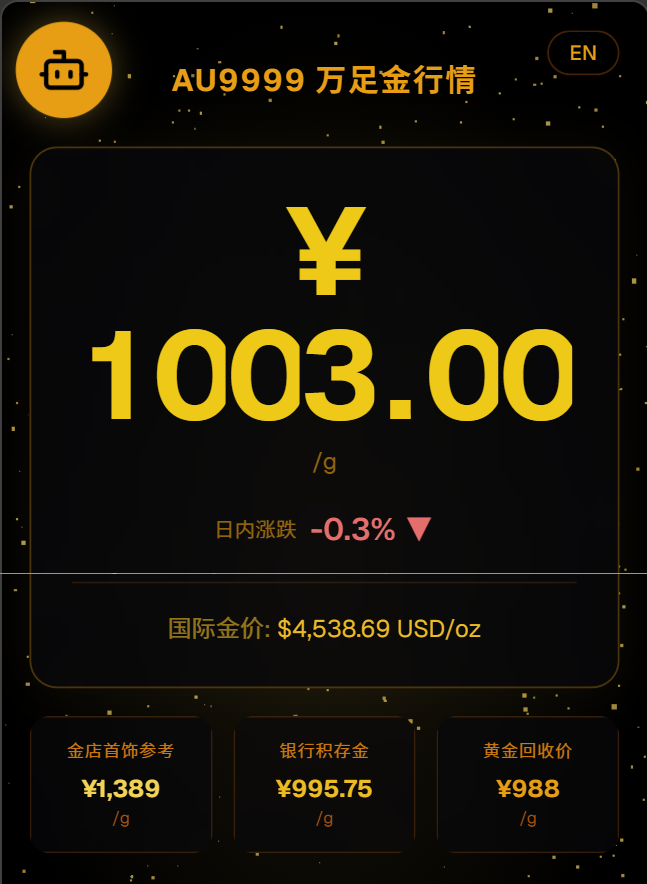
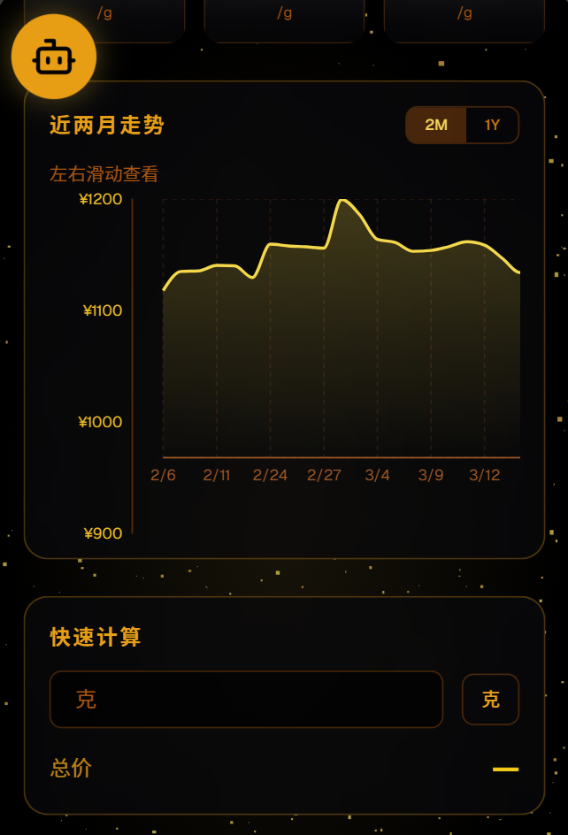
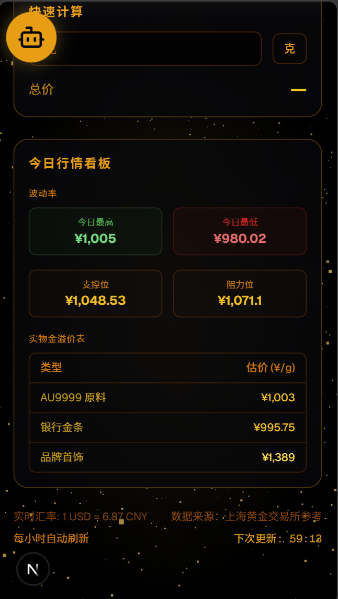
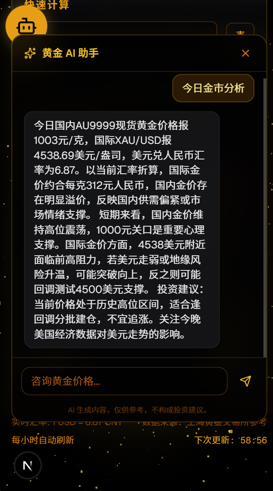

# AU9999 万足金行情监控

实时黄金价格监测面板，内置 AI 市场分析助手，移动端优先设计。

## 功能特性

- **Au9999 现货价** — 上海黄金交易所实时行情
- **国际金价 XAU/USD** — 全球金价，附带人民币兑美元隐含汇率
- **多维度价格对比** — 金店首饰零售、银行积存金、黄金回收价并列展示
- **历史走势图** — 近两月和近一年双模式切换，支持左右滑动，触摸跟随提示框
- **AI 智能助手** — DeepSeek 对话模型，自动注入实时行情，解答黄金投资问题
- **3D 粒子背景** — Three.js 黄金瀑布效果，增强空间深度感
- **点击涟漪反馈** — 价格卡片点击触发金色光晕扩散和缩放动画
- **快速计算器** — 克重与人民币双向换算
- **中英双语切换**
- **每小时自动刷新** — 倒计时显示距下次更新剩余时间
- **支撑位与阻力位** — 基于历史波动率实时计算

## 技术栈

| 分类 | 技术 |
|------|------|
| 框架 | Next.js 16 App Router + Turbopack |
| 界面 | React 19、Tailwind CSS 4、Framer Motion |
| 图表 | Recharts |
| 3D 渲染 | Three.js |
| AI 对话 | AI SDK v6 + DeepSeek |
| 图标 | Lucide React |
| 语言 | TypeScript |

## 快速开始

### 前置条件

Node.js 18 以上，并准备以下 API 密钥：

- **SHGOLD_APPCODE** — 阿里云探数 API 的 APPCODE
- **DEEPSEEK_API_KEY** — DeepSeek API 密钥

### 安装

bash：

npm install
### 环境变量

在项目根目录新建 `.env.local` 文件：

```env
SHGOLD_APPCODE=你的APPCODE
DEEPSEEK_API_KEY=sk-你的密钥
DEEPSEEK_BASE_URL=https://api.deepseek.com/v1

# 溢价参数（可选，下方为默认值）
JEWELRY_PREMIUM=410
BANKBAR_PREMIUM=12
RECYCLE_DISCOUNT=15
```

### 启动

```bash
npm run dev
```

浏览器访问 http://localhost:3000

### 生产构建

```bash
npm run build
npm start
```

## API

| 方法 | 路径 | 说明 |
|------|------|------|
| GET | `/api/gold` | 聚合金价数据（上海金、国际金、金店、积存金 + 历史走势） |
| POST | `/api/chat` | AI 助手流式对话，自动注入实时价格上下文 |

## 项目结构

```
app/
  page.tsx              # 主页面
  layout.tsx            # 根布局
  api/
    gold/route.ts       # 金价聚合接口
    chat/route.ts       # AI 对话接口
components/
  AIAssistant.tsx       # 可拖拽 AI 对话浮窗
  GoldParticles.tsx     # 3D 粒子背景
  RippleEffect.tsx      # 点击涟漪效果
```

## 截图预览

| 行情看板 | 走势图表 |
|:---:|:---:|
|  |  |

| AI 智能助手 | 市场矩阵与计算器 |
|:---:|:---:|
|  |  |

## 数据来源

阿里云 API 市场购买接口：

- **上海黄金交易所** — Au99.99 实时报价与日线历史数据
- **国际金价** — XAU/USD，来自探数 gjgold 接口
- **线下金店** — 国内品牌金店首饰金价，已过滤香港地区港币报价
- **银行积存金** — CNYAAU 银行纸黄金价格

回收价和首饰溢价基于现货价格加减可配置参数计算。
